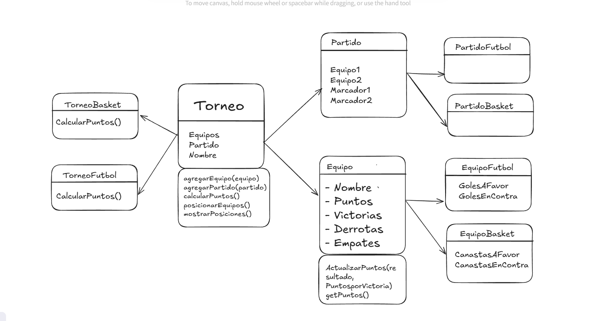

# POO_TLPIV_Torneo

Este proyecto es una aplicación de consola (**CLI**) desarrollada en **Node.js** que permite gestionar torneos de **fútbol** y **básquet**.  
El sistema permite registrar equipos, ingresar resultados de partidos, calcular automáticamente los puntos y mostrar la tabla de posiciones final.


## 📌 Características

- Soporte para **torneos de Fútbol** y **torneos de Básquet**.
- Registro dinámico de equipos desde la consola.
- Carga de resultados de partidos:
  - Fútbol: se permiten empates.
  - Básquet: no se permiten empates.
- Cálculo de estadísticas:
  - **Fútbol**: goles a favor, goles en contra, victorias, empates, derrotas.
  - **Básquet**: canastas a favor, en contra, victorias, derrotas.
- Sistema de puntos configurable:
  - Fútbol: 3 puntos por victoria, 1 por empate.
  - Básquet: 2 puntos por victoria.
- Genera tabla de posiciones ordenada automáticamente.

## 🛠️ Como correr el proyecto
1. Clona el repositorio:
   ```bash
   git clone https://github.com/carlosNahuelSanchez/POO_TLPIV_Torneo.git

    cd POO_TLPIV_Torneo
    ```

    2. Correr el proyecto:
    ```bash
    node index.js
    ```

## Ejemplo de Entrada y Salida

```bash
    
=== Bienvenido al sistema de Torneo CLI ===
    Ingrese el nombre del torneo: Torneo
    Ingrese el tipo de torneo (1: Futbol / 2: Basket): 1
    Ingrese la cantidad de equipos: 2
    Nombre del equipo 1: Team1
    Nombre del equipo 2: Team2

    --- Ingrese resultados de cada partido ---

    Partido: Team1 vs Team2
    Goles de Team1: 2
    Goles de Team2: 0

    === Tabla de posiciones ===
    1. Team1 - Puntos: 3
    2. Team2 - Puntos: 0
 ```


